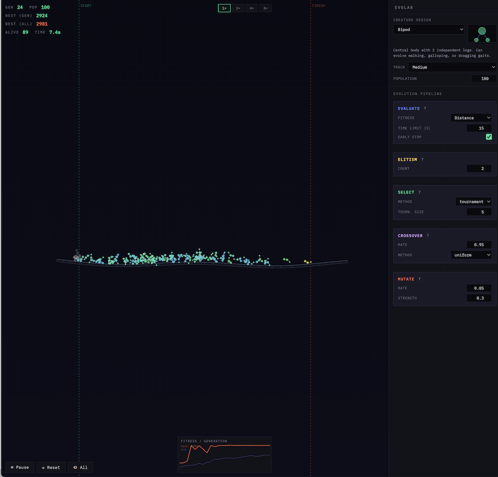

# EvoLab

**EvoLab** is a browser-based neuroevolution sandbox where users design and tune an evolutionary pipeline to optimize physics-driven creatures across 2D terrain. Rather than controlling creatures directly, players configure the evolutionary process itself — adjusting selection methods, crossover rates, mutation strength, elitism counts, and fitness functions through a visual flow editor — then watch as populations of spring-jointed creatures evolve locomotion strategies in real time using Matter.js physics. The app ships as two files (one HTML, one JS), runs entirely client-side with no build step, and offers five creature body plans (roller, hopper, snake, bipod, triball), four fitness modes (distance, finish speed, efficiency, sprint), adjustable track lengths, and speed controls, with all configuration persisted across sessions via localStorage.

This is a fun little experiment I developed with claude code.

## Interface

### Simulation Canvas (left)

- **Terrain view** — creatures traverse undulating 2D ground from START to FINISH markers
- **Ghost overlay** — faint replay of the all-time best creature's run
- **Pan** — click and drag anywhere
- **Zoom** — scroll wheel, centered on viewport
- **HUD (top-left)** — generation count, population, best fitness (gen / all-time), alive count, sim time
- **Speed (top-right)** — 1×, 2×, 4×, 8× simulation speed
- **Controls (bottom-left)** — pause/resume, reset, show all / show best toggle
- **Fitness graph (bottom-right)** — best (orange) and average (blue) fitness over generations

### Control Panel (right)

#### Creature & Environment
- **Body plan dropdown** — Roller, Hopper, Snake, Bipod, Triball — with preview sketch and description
- **Track length** — Short (1500), Medium (3000), Long (6000)
- **Population size** — adjustable, 4–200

#### Evolution Pipeline
Five fixed steps, each with inline controls and a `?` info tooltip:

- **Evaluate** — fitness mode (Distance / Finish Speed / Efficiency / Sprint), time limit (3–120s), early stop toggle
- **Elitism** — number of top creatures preserved unchanged
- **Select** — method (tournament / roulette), tournament size
- **Crossover** — rate (0–1), method (uniform / single-point)
- **Mutate** — rate (0–1), strength (0–1)

#### Persistence
- All settings saved to localStorage automatically, restored on reload

## Technical

### Creature Representation

- **Genome** — a flat array of floats in [-1, 1], length varies by body plan (9–17 genes)
- **Encoding** — genes decode into body segment radii, joint oscillator parameters (phase, frequency, amplitude), and body-plan-specific values (leg lengths, link lengths, stiffness)
- **Locomotion** — no neural network; each joint has a sinusoidal oscillator that applies perpendicular and axial forces between connected body segments at each physics tick
- **Physics** — Matter.js rigid bodies (circles) connected by spring constraints, with collision filtering so creatures interact with terrain but not each other

### Fitness Functions

- **Distance** — max horizontal displacement from start line
- **Finish Speed** — distance + time bonus for crossing the finish (faster = higher bonus)
- **Efficiency** — distance minus cumulative energy expenditure (penalizes flailing)
- **Sprint** — finishers scored by speed, non-finishers get 10% of distance (harsh selection pressure)

### Genetic Operators

- **Selection** — tournament (best of k random candidates) or roulette (probability proportional to fitness)
- **Crossover** — uniform (each gene randomly from either parent) or single-point (genome split and halves swapped), applied at a configurable rate
- **Mutation** — per-gene Gaussian perturbation clamped to [-1, 1], with configurable rate (probability per gene) and strength (perturbation magnitude)
- **Elitism** — top-n creatures copied unchanged into the next generation, exempt from mutation

### Boundary Rules

- Creatures that drift left past the start line are frozen (dead)
- Creatures that cross the finish line are frozen (finished)
- Creatures that fall far below the terrain are killed
- Generation ends at the time limit, or early if all creatures are dead/finished/stalled